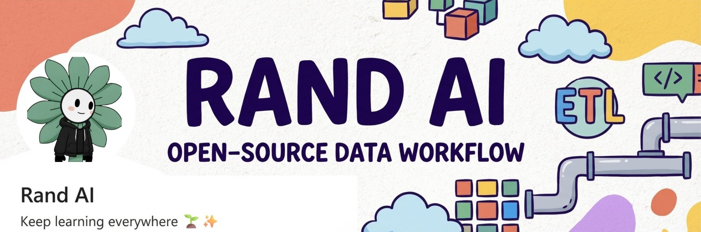

# 🤖 Open Source AI Automation Workflows



## 📝 Description
- Currently focused on the development of an open-source data workflow framework designed to optimize cloud ETL pipelines—delivering a cost-efficient and robust alternative to n8n and Make, built with modular and scalable architecture for data engineers.

## 🎯 Purpose
- Simplify the automation of manual operations
- Provide unlimited-use solutions
- Offer free alternatives to tools like Zapier, n8n, Make, etc.
- Avoid unsustainable subscription costs
- Improve the scalability of your automations

## 💡 Advantages
- **Open Source**: All the code is transparent and customizable
- **No Recurring Costs**: No monthly subscriptions involved
- **Scalable**: Adapt and improve each workflow to fit your needs
- **Clear Documentation**: Every workflow includes step-by-step instructions
- **Lightweight Infrastructure**: No expensive resources required

## 🚀 Getting Started
1. Clone this repository
2. Review the documentation for the workflow you need
3. Follow the step-by-step instructions
4. Run your automation!

## 🤝 Help and Support
Using [Cursor](https://cursor.com/) or an AI assistant is recommended to better understand the code. Each workflow is documented in detail to make onboarding easier.

## 🎯 Target Audience
- Entrepreneurs
- Startups
- Indie makers
- Developers
- Anyone looking to automate tasks without recurring costs

## 📢 Important Note
This project was created as a response to common pain points in no-code tools:
- High subscription costs
- Limited scalability
- Dependence on external infrastructure
- Customization restrictions

## 🤝 Contributions
Contributions are welcome! If you have an automation workflow to share, feel free to open a pull request.

## 📝 License
This project is open source and distributed under the MIT License.

# YouTube Shorts Creator

This script automates the creation of YouTube Shorts from long-form videos, including automatic transcription and subtitles.

## Key Features

- Extracts random segments from long videos
- Converts videos to vertical format for Shorts
- Transcribes audio using OpenAI Whisper
- Generates synchronized subtitles
- Uploads files to Google Drive automatically
- Updates metadata in Google Sheets
- Optimizes titles and generates relevant hashtags

## Requirements

1. Python 3.8 o superior
2. ffmpeg installed on the system
3. Google Cloud account with APIs enabled:
   - Google Drive API
   - Google Sheets API
4. OpenAI API key

## Installation

1. Install ffmpeg:
```bash
# Ubuntu/Debian
sudo apt-get update
sudo apt-get install ffmpeg

# Windows
# Download from https://ffmpeg.org/download.html
```

2. Install Python dependencies:
```bash
pip install -r requirements.txt
```

3. Configure environment variables:
Create a `.env` file with:
```
OPENAI_API_KEY=your_openai_key
YOUTUBE_API_KEY=your_youtube_key
```

4. Configure Google credentials:
- Place the Google Cloud service account credentials file in the root directory

5. Create the required directories:
```bash
mkdir shorts_output temp audio_transcription
```

## Usage

```python
from youtube_shorts_creator import YouTubeShortsCreator

# Configure parameters
num_shorts = 15  # Number of shorts to generate
start_time_minutes = 10  # Minute mark to start from

# Instantiate the creator
creator = YouTubeShortsCreator(num_shorts=num_shorts, start_time_minutes=start_time_minutes)

# Process the video
url = "YOUTUBE_VIDEO_URL"
shorts = creator.process_video(url)
```

## Approximate Costs (based on logs)

- Whisper API:
  - ~$0.045 USD per 7.5 minutes of audio
  - Approximately $0.006 USD per minute

- GPT-3.5:
  - ~$0.0024 USD for input tokens
  - ~$0.0022 USD for output tokens
  - Approximate total for 15 shorts: $0.0496 USD

## Directory Structure

```
├── shorts_output/      # Downloaded videos
├── temp/               # Temporary files
└── audio_transcription/ # Generated shorts
```

## Limitations

- The source video must be long enough to extract the requested segments
- Each short has a fixed duration of 30 seconds
- An internet connection is required for the OpenAI and Google APIs
