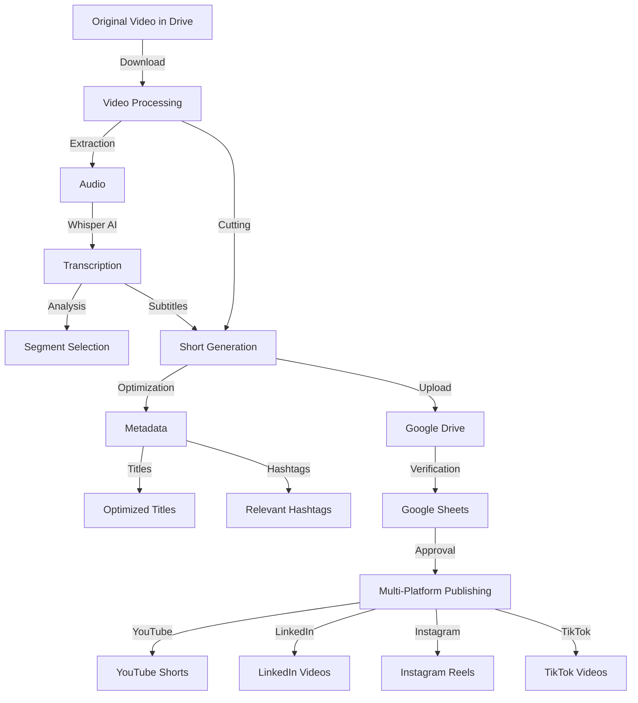

# 🎥 YouTube Shorts Creator & Social Media Publisher

Automated system to create and publish content across multiple social platforms from long-form videos.

## 🔒 Seguridad Importante

⚠️ **NEVER upload credentials to GitHub or any public repository** ⚠️

1. **Protected Files** (do not commit to git):
   - `service_account.json` (service account)
   - `.env` (environment variables)
   - Any file containing credentials

2. **Security Verification**:
   ```bash
   # Confirm that your credentials are in .gitignore
   cat .gitignore | grep "service_account.json"
   
   # Confirm that the file is not being tracked
   git status | grep "service_account.json"
   ```

## 📊 Diagrama de Flujo



## 🌟 Features

- ✂️ **Smart Cutting**: Splits long videos into optimized shorts
- 🎯 **Automatic Transcription**: Powered by Whisper AI
- 📝 **Subtitle Generation**: Embedded directly in the video
- 🔍 **SEO Optimization**: Titles and hashtags tuned for discovery
- 📊 **Sheets Management**: Control and approve content centrally
- 🚀 **Multi-Platform**: Publishes to:
  - YouTube Shorts
  - LinkedIn
  - Instagram Reels
  - TikTok

## 🛠️ Requirements

1. **Python 3.8+**
2. **Credentials**:
   - Google Service Account (Drive, Sheets, YouTube)
   - Instagram credentials
   - LinkedIn API token
   - TikTok session ID

3. **Dependencies**:
   ```bash
   pip install -r requirements.txt
   ```

## ⚙️ Configuration

1. **Service Account**:
   - Store `service_account.json` in the project root
   - ⚠️ Ensure the file is listed in `.gitignore`
   - NEVER share or upload this file

2. **Environment Variables**:
   - Create a `.env` file based on `.env.example`
   - ⚠️ Do not commit the `.env` file to git
   ```env
   OPENAI_API_KEY="your_api_key"
   YOUTUBE_API_KEY="your_api_key"
   INSTAGRAM_USERNAME="your_username"
   INSTAGRAM_PASSWORD="your_password"
   LINKEDIN_ACCESS_TOKEN="your_token"
   ```

## 🚀 Uso

1. **Run the script**:
   ```bash
   python publish_shorts.py
   ```

2. **Workflow**:
   - Upload your long-form video to Google Drive
   - The system processes the video and generates shorts
   - Review and approve them in Google Sheets
   - Approved items are published automatically

## 📁 Directory Structure

```
automate_scripts/
├── publish_shorts.py
├── requirements.txt
├── .env
├── service_account.json
├── audio_transcription/
└── shorts_output/
```

## 🔄 Automated Process

1. **Processing**:
   - Download video from Drive
   - Extract audio
   - Generate transcription
   - Create shorts with subtitles

2. **Optimization**:
   - Generate compelling titles
   - Create relevant hashtags
   - Optimize metadata

3. **Publishing**:
   - Check approvals in Sheets
   - Publish to configured platforms
   - Update status in Sheets

## ⚠️ Important Notes

- Working directories are cleaned automatically after each run
- Proper permissions are required for all APIs
- Make sure platform-specific size and duration limits are respected

## 📝 Logs

The system keeps a detailed record of:
- Video downloads
- Content processing steps
- Successful/failed publications
- Directory cleanup operations

## 🛡️ Security Best Practices

1. **Credential Protection**:
   - Keep credentials out of git
   - Use `.gitignore` to exclude sensitive files
   - Regularly verify that nothing sensitive is exposed

2. **Sensitive File Handling**:
   - Store credentials locally
   - Do not share them via email or messaging
   - Use secret managers when possible

3. **Credential Rotation**:
   - Rotate credentials periodically
   - Immediately revoke compromised keys
   - Maintain an access log